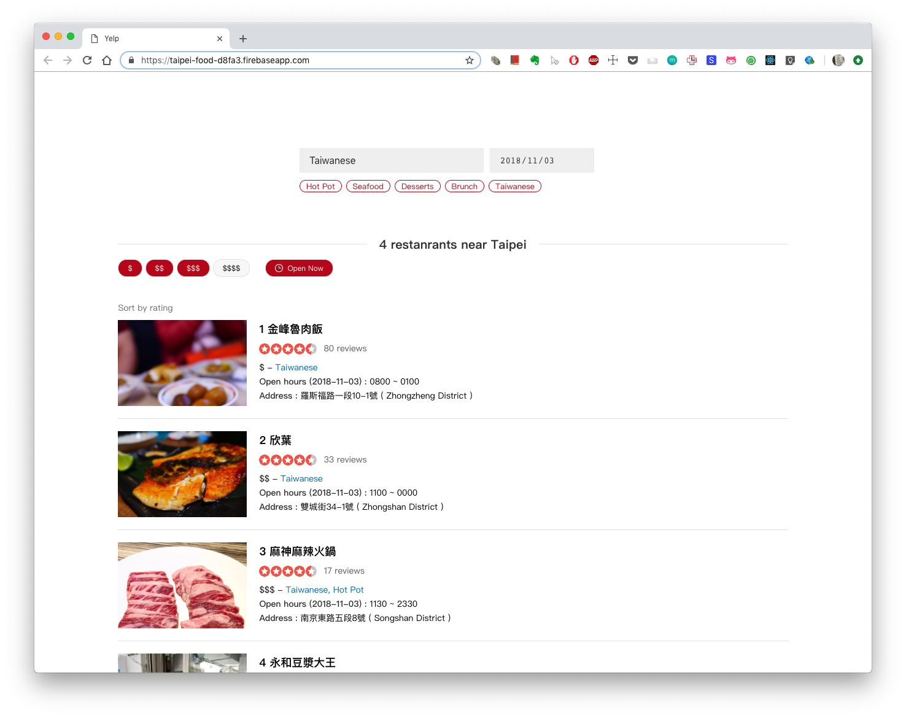

# Taipei food


[Demo](https://taipei-food-d8fa3.firebaseapp.com/)




<br/>


## Features

* Allow users to type keyword to filter restaurants. Includes keywords below.
  * restaurant name
  * food categories like seafood, desserts..
* Allow users to filter restaurants by price level, from cheap to expensive represents by dollar sign `$ (cheap)` - `$$$$ (expensive)`

* Sort filter results by restaurant rating score
* Open now. Users can filter restaurants by if that restaurant is open now.
* View open hour information by pick a date.

<br/>


## Assumption

#### Locals prefer get recommendation by food category

I think there are two target users in this website, one is local people who don't familiar with this city much, the other is tourists.
When local people come to a food recommendation website, I assume they are more likely want to get some recommendations base on some categories options, like hot pot or seafood. So I made some design to allow users to select food categories easier. They can also filter restaurants by input those keywords. 

<br/>

#### Tourists prefer rating and review informations

All results are sorted by rating information.


<br/>


#### Filter by multiple conditions

Some people like to filter by food category, some like to filter by budgets, all have their reason and preference. So I made multple filter options, and results are intersect by filter options selected. 


<br/>

## Install taipei-food

#### Create a file path to clone Taipei-food
```
$ mkdir projects
$ cd projects
```
<br/>

#### Clone taipei-food under that path
```
$ git clone git@github.com:skyying/taipei-food.git
```
<br/>

#### Go to taipei-food
```
$ cd taipei-food
```
<br/>

#### Install packages
```
npm install
```
<br/>

#### Run taipei-food
```
npm start
```


